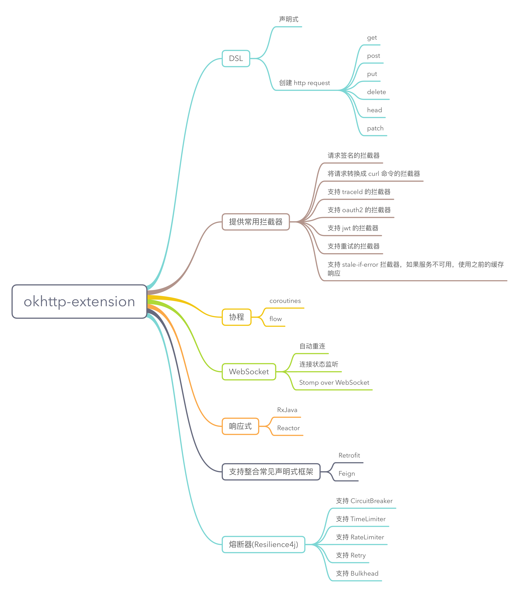

[](http://www.weibo.com/fengzhizi715)
[](https://www.apache.org/licenses/LICENSE-2.0.html)
[](https://jitpack.io/#fengzhizi715/okhttp-extension)

# okhttp-extension

okhttp-extension 是针对 okhttp 3 增强的网络框架。使用 Kotlin 特性编写，提供便捷的 DSL 方式创建网络请求，支持协程、响应式编程等等。

其 core 模块只依赖 okhttp，不会引入第三方库。

okhttp-extension 可以整合 Retrofit、Feign 框架，还提供了很多常用的拦截器。 另外，okhttp-extension 也给开发者提供一种新的选择。

## Features:

* 支持 DSL 创建 HTTP `GET`/`POST`/`PUT`/`HEAD`/`DELETE`/`PATCH` requests.
* 支持 Kotlin 协程
* 支持响应式(RxJava、Spring Reactor)
* 支持函数式
* 支持熔断器(Resilience4j)
* 支持异步请求的取消
* 支持 Request、Response 的拦截器
* 提供常用的拦截器
* 支持自定义线程池
* 支持整合 Retrofit、Feign 框架
* 支持 Websocket 的实现、自动重连等
* core 模块只依赖 okhttp，不依赖其他第三方库




## 最新版本
模块|最新版本
---|:-------------:
core|[](https://jitpack.io/#fengzhizi715/okhttp-extension)|
coroutines|[](https://jitpack.io/#fengzhizi715/okhttp-extension)|
rxjava3|[](https://jitpack.io/#fengzhizi715/okhttp-extension)|
rxjava2|[](https://jitpack.io/#fengzhizi715/okhttp-extension)|
reactor|[](https://jitpack.io/#fengzhizi715/okhttp-extension)|
result|[](https://jitpack.io/#fengzhizi715/okhttp-extension)|
resilience4j|[](https://jitpack.io/#fengzhizi715/okhttp-extension)|

## 下载

将它添加到项目的 root build.gradle 中：

```groovy
	allprojects {
		repositories {
			...
			maven { url 'https://jitpack.io' }
		}
	}
```

其余，按需依赖各个模块，其中 core 是必须要依赖的

```groovy
implementation 'com.github.fengzhizi715.okhttp-extension:core:<latest-version>'
```

```groovy
implementation 'com.github.fengzhizi715.okhttp-extension:coroutines:<latest-version>'
```

```groovy
implementation 'com.github.fengzhizi715.okhttp-extension:rxjava3:<latest-version>'
```

```groovy
implementation 'com.github.fengzhizi715.okhttp-extension:rxjava2:<latest-version>'
```

```groovy
implementation 'com.github.fengzhizi715.okhttp-extension:reactor:<latest-version>'
```

```groovy
implementation 'com.github.fengzhizi715.okhttp-extension:result:<latest-version>'
```

```groovy
implementation 'com.github.fengzhizi715.okhttp-extension:resilience4j:<latest-version>'
```

## TODO List:

* 完善和 Spring/Springboot 集成以及相关示例